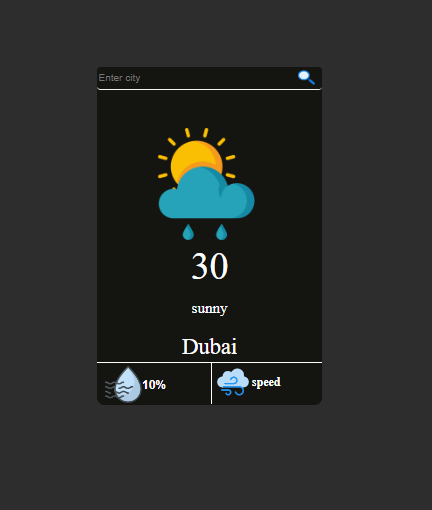
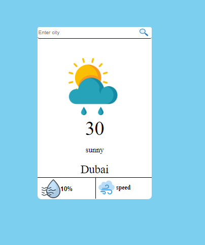

# Weather App

A simple weather app that displays the current weather information.





## Features

- Get the current weather information based on user location or search
- Display temperature, weather conditions, wind speed, and more
- Responsive design for different screen sizes
- Easy to use and intuitive user interface
- lightmode and dark mode

## Technologies Used

- HTML
- CSS
- JavaScript

## Installation

1. Clone the repository:

   ```shell
   git clone https://github.com/your-username/weather-app.git 
2 .Open index.html in a web browser.


## Usage
- Allow the browser to access your location to display the current weather based on your location automatically.
- Alternatively, use the search functionality to enter a location and retrieve the weather information.
- Screenshots
Screenshot 1
Screenshot 2

## Contributing
- Contributions are welcome! If you have any suggestions, improvements, or bug fixes, please open an issue or submit a pull request.
## License
- This project is licensed under the MIT License.
